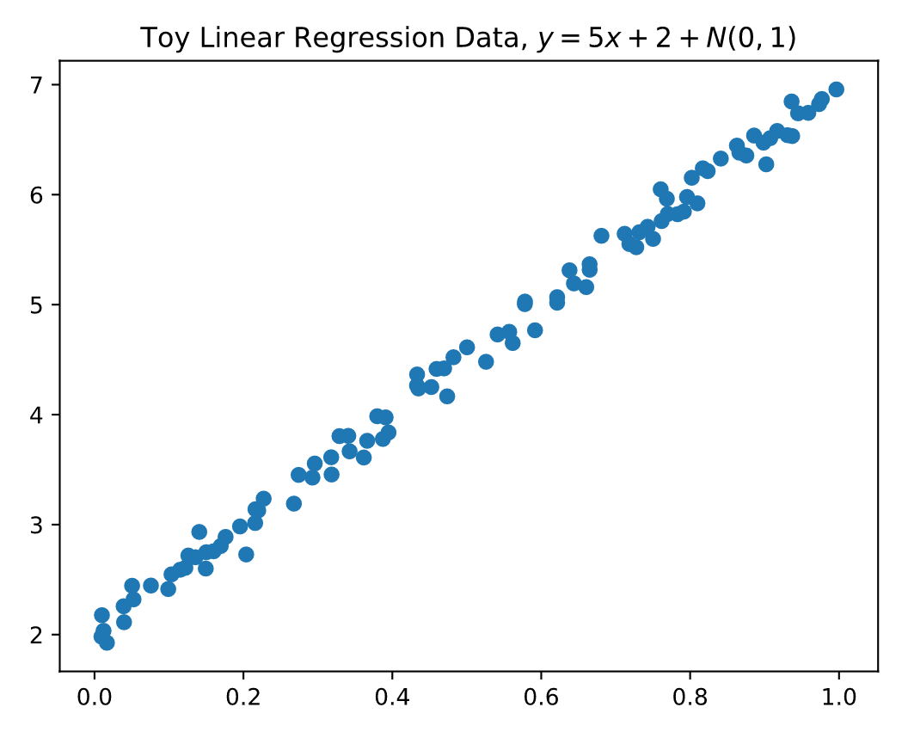
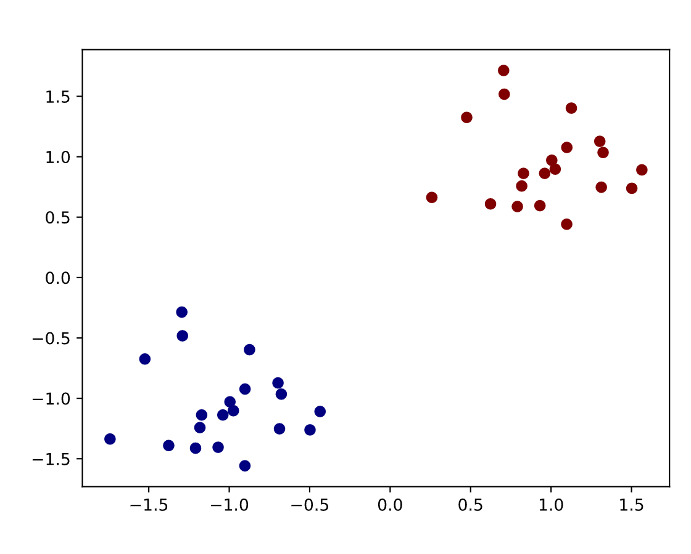
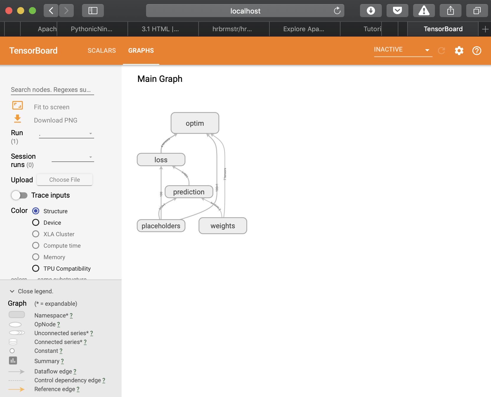
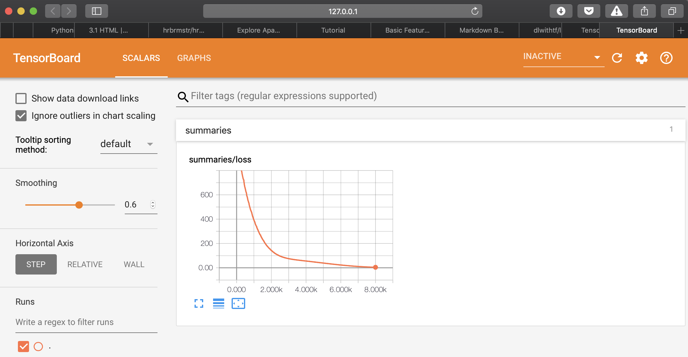

---
html:
  embed_local_images: true
  embed_svg: true
  offline: false
  toc:
    depth_from: 1
    depth_to: 6
    ordered: false
---
# TensorFlow Learning
### Artificial dataset generation with `numpy`
To generate a one-dimensional dataset with a small amount of Gaussian noise:
$y=wx+b+N(0, \epsilon)$

```py {cmd="/anaconda3/envs/deeplearning/bin/python" matplotlib}
import tensorflow as tf
import numpy as np
import matplotlib.pyplot as plt

N = 100
w = 5 # weight
b = 2 # bias
noise_scale = .1
x = np.random.rand(N,1)
noise = np.random.normal(scale=noise_scale, size=(N,1))

# convert shape of y_np to (N,)
y = np.reshape(w * x + b + noise, (-1))

# plot
plt.scatter(x, y)
plt.title("Toy Linear Regression Data, "
            r"$y = 5x + 2 + N(0, 1)$")
```


> ##### Primer on `np.reshape()`
> ```py {cmd="/anaconda3/envs/deeplearning/bin/python"}
> import numpy as np
> # a = [[1,2,3,4], [5,6,7,8], [9,10,11,12]]
> a = np.arange(1,13,1)
> a = np.reshape(a, (3,4))
> print(a, '\n -----')
> # flatten from n-dimensions to one dimension
> b = np.reshape(a, (4,-1))
> print(b)
> ```
> Notice that numpy allow us to use -1 to specify an unknown dimension; This is convenient for when we want the new shape to take say 4 rows and the remaining dimension to be figured out by numpy

To generate an artificial dataset suitable for classification tasks, we can make use of the `np.random.multivariate_normal` function. The following creates an `ndarray` named `a` which centered at (-1,1) with epsilon of .1. 

```py {cmd="/anaconda3/envs/deeplearning/bin/python" id="toy_ds"}
import numpy as np
x1 = np.random.multivariate_normal(
    mean=np.array((-1,-1)), 
    cov=.1 * np.eye(2), 
    size=(20,))
x2 = x1 + 2
# y = [0,0,0,..0]
y1 = np.zeros(20,)
y2 = y1 + 1
x = np.vstack([x1, x2])
y = np.concatenate([y1, y2])
```

We can thus verify that `x1` has been created as a two-dimensional array with the mean of each dimension centered around -1 (`(-1, -1)`). Supposed we wanted a toy dataframe with three dimensions, with the first and last centered around -1 and the second dimension centered around 0, we can pass `np.array((-1,0,-1))` to the `mean` parameter and `np.eye(3)` to the `cov` parameter. 

In the following code, observe the use of `np.vstack()` and `np.concatenate()` to see how the code can be combined to create our toy classification dataset.

```py {cmd="/anaconda3/envs/deeplearning/bin/python" continue="toy_ds"}
print(np.vstack([x1[0:3], x2[0:3]]), '\n ------')
print(np.concatenate([y1[0:3], y2[0:3]]))
```

Visualizing our toy dataset using `matplotlib`:
```py {cmd="/anaconda3/envs/deeplearning/bin/python" matplotlib continue="toy_ds"}
import matplotlib.pyplot as plt
# color (c) mapped to y
plt.scatter(x[:,0], x[:,1], c=y, cmap='jet')
```


### TensorFlow Concepts
- **Placeholders**: The input nodes through which information enters TensorFlow. These are what we use to control the input to our computational graph
    - Example: `tf.placeholder(tf.float32, shape=(2,2))`

- **Model Variables**: Variables that are going to be optimized as our computaional graph is run in every iteration

- **Feed dictionaries and Fetches**: _Feed dictionaries_ map `tf.Tensors` to `np.ndarray` objects that contain the concrete values for these placeholders, serving as input to a TensorFlow computation graph. The _fetch_ is a tensor whose value is retrieved after the computation
    > ```py {cmd="/anaconda3/envs/deeplearning/bin/python"}
    > import tensorflow as tf
    > a = tf.placeholder(tf.float32, shape=(1,))
    > b = tf.placeholder(tf.float32, shape=(1,))
    > c = a + b
    > feed_dict = {a: [1.], b: [2.]}
    > with tf.Session() as sess:
    >    result = sess.run(c, feed_dict=feed_dict)
    >    print(result)
    > ```

- **Name Scopes**: In a TensorFlow programs, there may be many tensors, variables and placeholders defined throughout the program. Name scopes is a mechanism for managing these collection of variables. Elements created within name scopes will have the name of its enclosing scope prepended
    > ```py {cmd="/anaconda3/envs/deeplearning/bin/python"}
    > import tensorflow as tf
    > N = 5
    > with tf.name_scope("chapter3"):
    >     x = tf.placeholder(tf.float32, (N,1))
    >     y = tf.placeholder(tf.float32, (N,))
    > print(x)
    > ```
- **Optimizers**: TensorFlow provides a collection of optimization algorithms in the `tf.train` module. Examples are `tf.train.GradientDescentOptimizer` and `tf.train.AdamOptimizer`.
- **Summaries and file writers for TensorBoard**: To make use of TensorBoard for visualizing the structure of a tensorial program, programmers must manually write logging statements. `tf.train.FileWriter()` specifies the logging directory for a TensorBoard program and `tf.summary()` writes summaries of various TensorFlow variables to the specified directory. `tf.summary.merge_all()` conveniently merges multiple summaries into a single summary.

    > ```py
    > with tf.name_scope("chapter3"):
    >     tf.summary.scalar("loss", l)
    >     merged = tf.summary.merge_all()
    > 
    > train_writer = tf.summary.FileWriter('/tmp/lr-train', tf.get_default_graph())
    > ```

When we execute our code, we can now navigate to the path we specified and will find our logs residing in `/tmp/lr-train`.

#### Training models with TensorFlow
---

_The following section is best viewed in a split-pane editor with `chapter3/linearregression.py` opened for reference_

---
In a typical TensorFlow operation, our script is comprised of the following:  
- The necessary imports
    > ```py
    > import numpy as np
    > import tensorflow as tf
    > from sklearn.metrics import mean_squared_error, accuracy_score
    > ```

- Helper functions and reshaped training data, `x` and `y`
    > ```py
    > def rms_score(y_true, y_pred):
    >     """Computes RMS error."""
    >     return np.sqrt(mean_squared_error(y_true, y_pred))
    > 
    > N = 100
    > w_true = 5
    > b_true = 2
    > noise_scale = .1
    > x_np = np.random.rand(N,1)
    > noise = np.random.normal(scale=noise_scale, size=(N,1))
    > y_np = np.reshape(w_true * x_np + b_true + noise, (-1))
    > ```

- Placeholders for data `x` and labels `y` along with some randomized, initialized weights
    > ```py
    > with tf.name_scope("placeholders"):
    >     x = tf.placeholder(tf.float32, (N,1))
    >     y = tf.placeholder(tf.float32, (N,))
    > with tf.name_scope("weights"):
    >     W = tf.Variable(tf.random_normal((1,1)))
    >     b = tf.Variable(tf.random_normal((1,)))
    > ```

- Defined a loss function and optimizer
    > ```py
    > with tf.name_scope("prediction"):
    >     y_pred = tf.matmul(x, W) + b
    > with tf.name_scope("loss"):
    >     l = tf.reduce_sum((y - tf.squeeze(y_pred))**2)
    > with tf.name_scope("optim"):
    >     train_op = tf.train.AdamOptimizer(.001).minimize(l)
    > ```

- Initialize variables and iteratively perform gradient descent (or any other optimizer of our choice) in a for-loop. In each iteration, we'll use `sess.run()` to fetch the `train_op` along with (if present) the merged summary and the loss `l` from the graph.
    > ```py
    > n_steps = 5000
    > with tf.Session() as sess:
    >     sess.run(tf.global_variables_initializer())
    >     # train model
    >     for i in range(n_steps):
    >         feed_dict = {x: x_np, y: y_np}
    >         _, summary, loss = sess.run([train_op, merged, l],  > feed_dict=feed_dict)
    >         print("step %d, loss: %f" %(i, loss))
    >         train_writer.add_summary(summary, i)
    > ```

- Use `sess.run()` but fetched the weights instead, and use the updated weights for prediction through `sess.run()` again. Compute the performance from our prediction using the `rms_score()` helper function:
    > ```py
    > n_steps = 5000
    > with tf.Session() as sess:
    >     sess.run(tf.global_variables_initializer())
    >     # train model
    >     for i in range(n_steps):
    >         ...
    >     # get weights
    >     w_final, b_final = sess.run([W, b])
    >     # make predictions
    >     y_pred_np = sess.run(y_pred, feed_dict={x: x_np})
    > rms = rms_score(y_np, y_pred_np)
    > print("RMS: %f" %rms)
    > ```

#### Invoking TensorBoard
Run `linearregression.py` on your machine and if we've used `tf.summary()` for logging you should find the files created in the specified path. In your terminal, invoke TensorBoard by running `tensorboard --logdir=/tmp/lr-train --host=127.0.0.1` and then navigate to the port. You will find a visualization of the TensorFlow architecture under the **Graphs** tab. TensorBoard has grouped all computational graph elements belonging to various `tf.name_scopes` and we can expand each group to see the individual components and internal variables that were created by TensorFlow.



#### Metrics for evaluating models
Looking at the loss curve from TensorBoard is one way of diagnosting and evaluating a model, in addition to more conventional regression diagnostic metrics such as the $R^2$ and the RMSE. 



